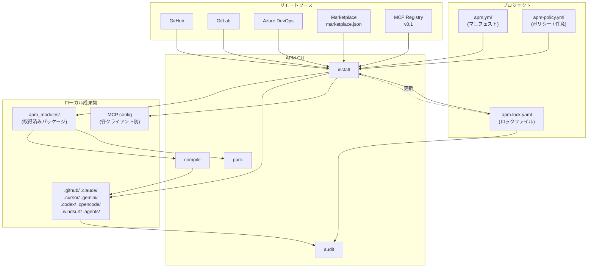

# APM (Agent Package Manager) — システム概要

**生成日:** 2026-05-21
**対象バージョン:** apm-cli v0.14.1 / apm.yml schema v0.10.0
**生成者:** AI Agent

---

## このシステムは何か

APM は AI コーディングエージェントの「コンテキスト」を 1 つのマニフェストファイルで宣言し、再現可能にする依存マネージャです。 `package.json`/`requirements.txt`/`Cargo.toml` をエージェント設定に置き換えたものと考えれば近い。プロジェクトのルートに `apm.yml` を置いておけば、リポジトリをクローンした誰もが `apm install` 一発で GitHub Copilot / Claude Code / Cursor / OpenCode / Codex / Gemini / Windsurf の各クライアントに同じ skills・prompts・agents・hooks・MCP server を配置できる。

APM が解決する根本問題は、AI エージェントの「コンテキスト = 命令を含むデータ」が事実上の実行コードであるにもかかわらず、どのチームも手作業で `.github/copilot-instructions.md` や `.claude/`、`.cursor/` を個別に維持していた点にある。APM はこれを「マニフェスト + ロックファイル + ポリシー」のレイヤーで標準化し、(1) ポータブル、(2) セキュア、(3) ガバナンス可能、の 3 つを同時に提供する。

対象ユーザーは大きく 3 ロールに分かれる。**コンシューマ**（プロジェクトに依存を取り込む開発者）、**プロデューサ**（skills/agents/plugin を発行するパッケージ著者）、**エンタープライズ**（組織全体に許可ソース・MCP・プリミティブのポリシーを敷くセキュリティ担当）。リポジトリの `docs/` も `consumer/`、`producer/`、`enterprise/` の 3 ディレクトリで明確に分かれている。

---

## 3 つの約束

| 約束 | 提供物 | 主なコマンド |
|------|--------|-------------|
| **Portable by manifest** | `apm.yml` が全プリミティブと MCP を宣言、`apm install` で全クライアントへ同時配置 | `install` / `compile` / `pack` |
| **Secure by default** | 隠し Unicode スキャン、lockfile 整合性、ハッシュ検証、MCP 信頼境界 | `audit` / `outdated` |
| **Governed by policy** | `apm-policy.yml` による組織横断の allow-list、tighten-only 継承、CI ゲート | `policy` / `audit --ci` |

詳細は [3 つの約束のセクション](#3-つの約束の詳細) を参照。

---

## 主要機能

| 機能 | 概要 | 詳細 |
|------|------|------|
| パッケージインストール | GitHub / GitLab / Azure DevOps / Bitbucket / Gitea / Gogs / 任意 git host から skills・agents・instructions・hooks・MCP server を取得 | [COMMANDS.md#apm-install](./COMMANDS.md#apm-install) |
| マルチクライアント配置 | 1 マニフェスト → 7 クライアントに自動配置（Copilot/Claude/Cursor/OpenCode/Codex/Gemini/Windsurf） | [USE-CASES.md#マルチクライアント展開](./USE-CASES.md#シナリオ-3-7-クライアントへ-1-コマンドで展開する) |
| コンパイル | 個別プリミティブから `AGENTS.md` / `CLAUDE.md` / `GEMINI.md` / `.github/copilot-instructions.md` を生成 | [COMMANDS.md#apm-compile](./COMMANDS.md#apm-compile) |
| MCP サーバ統合 | stdio / http / sse / streamable-http transport を Copilot/Claude/Cursor/Windsurf に同時登録 | [COMMANDS.md#apm-mcp](./COMMANDS.md#apm-mcp) |
| Marketplace | 自前/他者の plugin レジストリを登録、検索、消費、発行する | [COMMANDS.md#apm-marketplace](./COMMANDS.md#apm-marketplace) |
| Plugin オーサリング | `plugin.json` を出力する標準 plugin を依存マネージャ付きで作成 | [COMMANDS.md#apm-plugin](./COMMANDS.md#apm-plugin) |
| Audit & Drift 検出 | lockfile drift、デプロイ済みファイルの hand-edit、隠し Unicode を検出 | [COMMANDS.md#apm-audit](./COMMANDS.md#apm-audit) |
| Policy 強制 | org/repo の階層継承、tighten-only、warn → block の段階導入 | [COMMANDS.md#apm-policy](./COMMANDS.md#apm-policy) |
| Pack & 配布 | `apm pack` で bundle / plugin として配布、`apm install ./bundle.tar.gz` で air-gapped 環境へ | [USE-CASES.md#オフライン配布](./USE-CASES.md#シナリオ-7-air-gapped-環境にオフラインで配布する) |
| Runtime 管理 | Copilot CLI / Codex CLI / LLM CLI / Gemini CLI のインストールと設定 | [COMMANDS.md#apm-runtime](./COMMANDS.md#apm-runtime) |

---

## 対応エージェントクライアント

APM は 11 のターゲットプロファイルを 4 つのコンパイルファミリーで管理する。各ターゲットは固有のディレクトリと出力フォーマットを持つ。

| ターゲット | ルートディレクトリ | サポートする primitive | MCP 統合 |
|----------|----------------|--------------------|---------|
| `copilot` | `.github/` | instructions / prompts / agents / skills / hooks | `~/.copilot/mcp-config.json` |
| `claude` | `.claude/` | rules / agents / commands / skills / hooks | `.mcp.json` / `~/.claude.json` |
| `cursor` | `.cursor/` | rules (`.mdc`) / agents / commands / skills / hooks | `.cursor/mcp.json` |
| `opencode` | `.opencode/` | agents / commands / skills | — |
| `gemini` | `.gemini/` | commands (`.toml`) / skills / hooks | — |
| `codex` | `.codex/` | agents (`.toml`) / skills / hooks | — |
| `windsurf` | `.windsurf/` | rules / agent-skills / workflows / hooks | `.windsurf/mcp_config.json` |
| `agent-skills` | `.agents/` | skills のみ（クライアント間共有） | — |
| `copilot-cowork` | OneDrive 動的解決 | skills のみ（実験的、user-scope） | — |
| `copilot-app` | `~/.copilot/data.db` | prompts のみ（実験的、SQLite テーブル） | — |

`apm.yml` の `target:` フィールドで明示するか、各ターゲットのルートディレクトリの存在によって自動検出される。何も検出されない場合は `copilot` がデフォルト。詳細は [CONFIGURATION.md](./CONFIGURATION.md#ターゲット指定) を参照。

---

## プリミティブ（配置可能なリソース）

| プリミティブ | 用途 | 配置例 |
|-----------|------|--------|
| `instructions` | エージェントの行動規範・コーディング規約 | `.github/instructions/*.instructions.md` |
| `prompts` | 再利用可能なプロンプトテンプレート | `.github/prompts/*.prompt.md` |
| `agents` | 役割を持ったサブエージェント定義 | `.claude/agents/*.md` / `.codex/agents/*.toml` |
| `commands` | スラッシュコマンド | `.claude/commands/*.md` / `.cursor/commands/*.md` |
| `skills` | 自己完結したスキル（プログレッシブディスクロージャ対応） | `.agents/skills/<name>/SKILL.md` |
| `hooks` | PreToolUse/PostToolUse 等のフック | `.claude/settings.json` 等にマージ |
| `chatmodes` / `contexts` | コンパイル時のみ参照（配置されない） | コンパイル時のフロントマター |

---

## システム構成

---

## 技術要件

| 要素 | 必要バージョン | 備考 |
|------|-------------|------|
| Python | >= 3.10 | apm-cli は pip からも入る |
| OS | macOS / Linux / Windows x86_64 | ネイティブバイナリあり |
| Git | コマンドラインから利用可能 | サブモジュール解決とソースクローンに使用 |
| ネットワーク | GitHub / GitLab / Azure DevOps への HTTPS | air-gapped は Registry proxy 経由 |
| 認証 | GITHUB_APM_PAT / GITHUB_TOKEN / `gh auth token` / ADO_APM_PAT 等 | プライベートリポジトリ向け |

依存ライブラリ抜粋: `click>=8.0`, `pyyaml>=6.0`, `requests>=2.31`, `python-frontmatter>=1.0`, `llm>=0.17`, `rich>=13.0`, `GitPython>=3.1`, `ruamel.yaml>=0.18`, `filelock>=3.12`。

---

## ディレクトリの役割

ルート直下の主要ディレクトリ:

| パス | 役割 |
|------|------|
| `apm.yml` | プロジェクトのマニフェスト |
| `apm.lock.yaml` | 解決済み依存ツリーのピン留め |
| `apm_modules/` | 取得済みパッケージのキャッシュ（コンシューマ側） |
| `.github/` | Copilot のコンパイル出力 / instructions / prompts |
| `.claude/` `.cursor/` `.codex/` `.gemini/` `.opencode/` `.windsurf/` | 各クライアントの配置先 |
| `.agents/` | クライアント横断で共有される skills |
| `~/.apm/` | グローバル設定とユーザースコープインストール先 |
| `~/.apm/config.json` | CLI のグローバル設定 |
| `docs/` | プロジェクト公式ドキュメント（Astro Starlight） |
| `src/apm_cli/` | CLI 実装本体 |
| `tests/` | unit / integration / e2e テスト（733 ファイル超） |
| `templates/` | `hello-world/` 等のサンプルプロジェクト |
| `packages/` | APM 自身を APM パッケージ化した dogfood |

---

## 関連ドキュメント

- [クイックスタート](./QUICKSTART.md) — インストールと最初の `apm install` まで
- [コマンドリファレンス](./COMMANDS.md) — 30 + のコマンドを網羅
- [ユースケース](./USE-CASES.md) — 7 つの代表的シナリオ
- [設定ガイド](./CONFIGURATION.md) — マニフェスト / ロックファイル / ポリシー / 環境変数
- [トラブルシューティング](./TROUBLESHOOTING.md) — よくある問題と診断手順

公式ドキュメント (Microsoft 提供):

- 上流: <https://microsoft.github.io/apm/>
- リポジトリ: <https://github.com/microsoft/apm>
- 依存マネージャの全体像: `docs/src/content/docs/concepts/what-is-apm.md`

---

## 3 つの約束の詳細

### Portable by manifest

`apm.yml` 1 ファイルがすべての primitive と MCP server を宣言する。`apm install` は依存ツリー（推移的依存含む）を解決し、`apm.lock.yaml` に SHA とハッシュをピンする。同じロックファイルがあれば、別マシンでも同じファイル群が同じパスに配置される。

`apm compile` は配置済みプリミティブを各クライアント固有の集約形式に変換する。例えば Copilot ターゲットなら `.github/copilot-instructions.md` を生成し、VS Code の Copilot が自動的に読む。

### Secure by default

エージェントへの「指示」は LLM にとってのプログラムである。APM は次の防御層を持つ:

1. **隠し Unicode スキャン**: zero-width / invisible / directional character を `apm install` と `apm audit` で検出
2. **Lockfile integrity**: 解決ソースとコンテンツハッシュをロックファイルに記録
3. **Drift detection**: scratch でビルドし直したファイル群と作業ツリーを diff
4. **MCP 信頼境界**: 推移的 MCP server は明示的同意 (trust prompt) で導入

### Governed by policy

`apm-policy.yml` でセキュリティチームが組織横断のルールを定義する。階層は: enterprise → org → repo の tighten-only 継承（下位は厳しくしかできない）。`bypass_label` で例外運用も可能。CI には `apm audit --ci` を仕込んで branch protection と組み合わせる。
